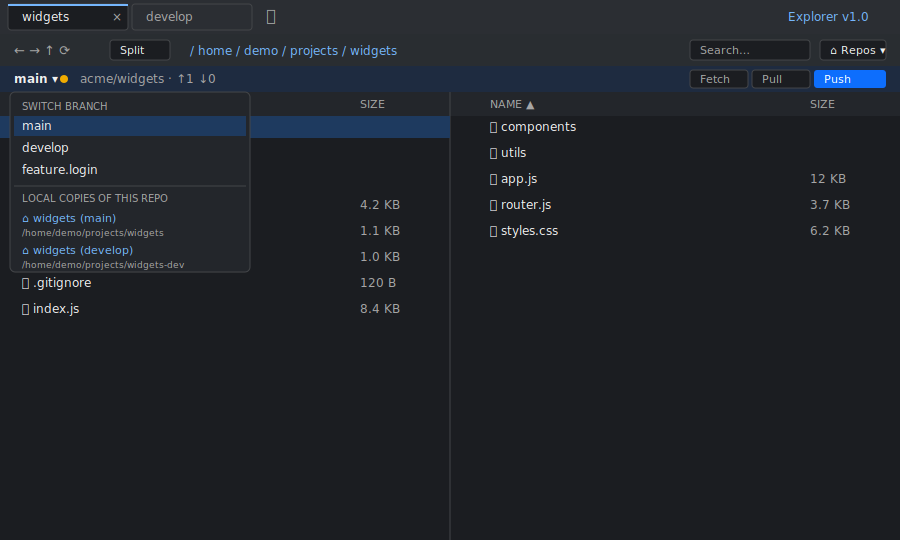
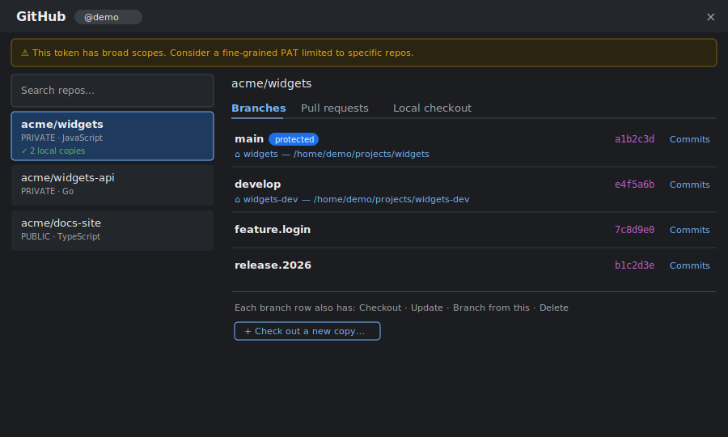
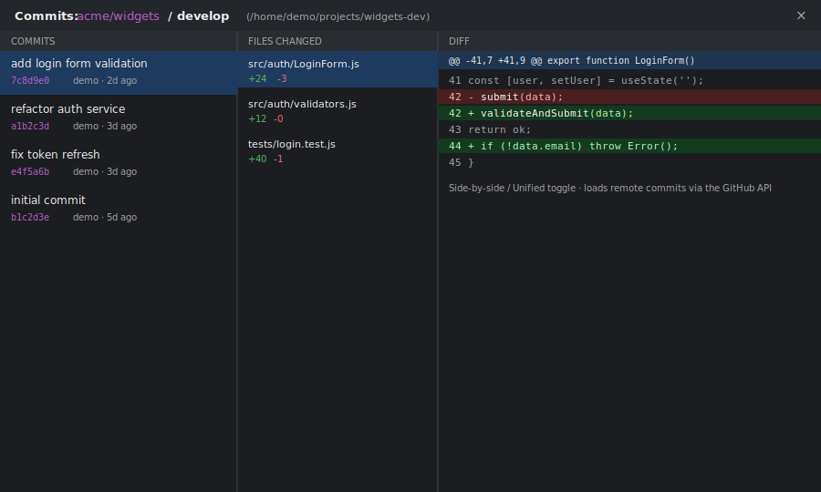
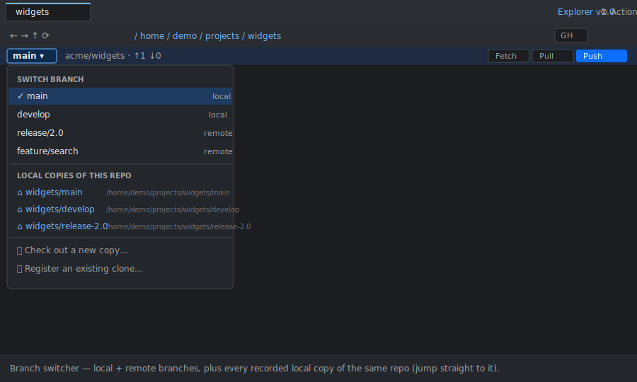
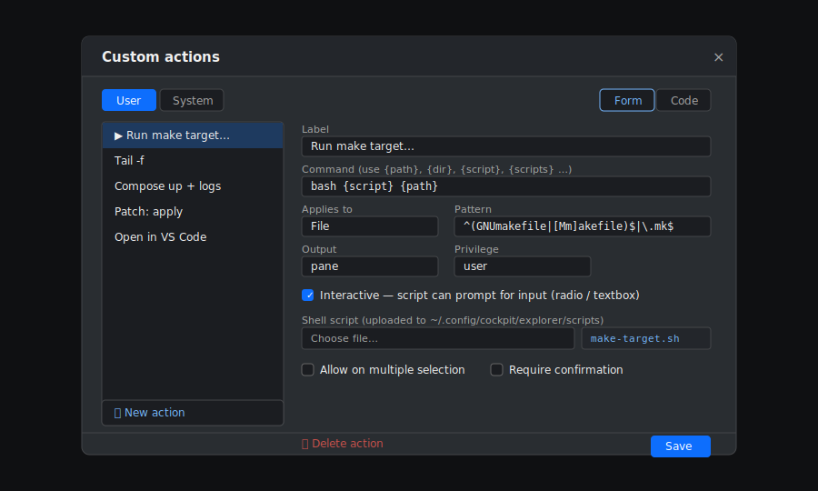
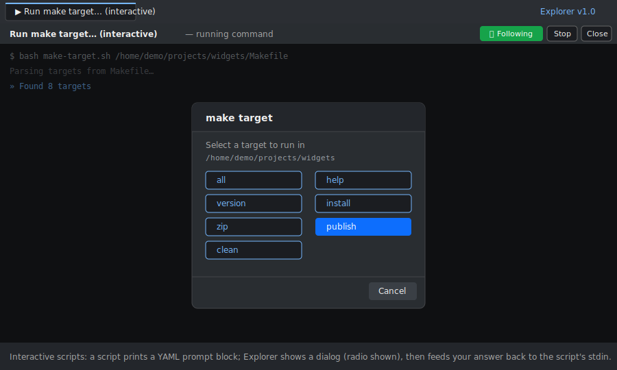
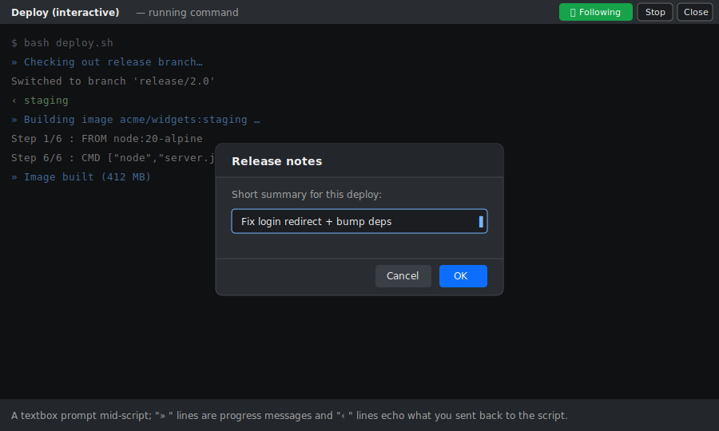
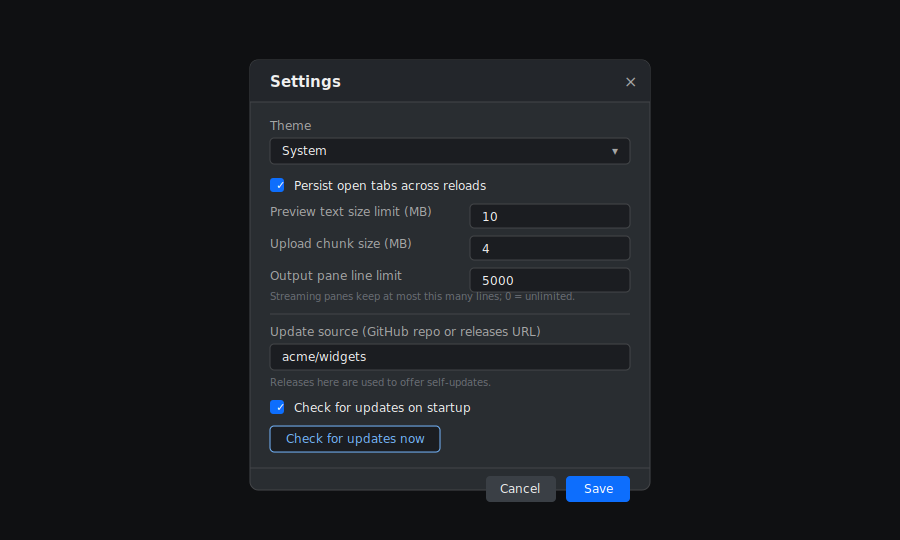

# Explorer — a Cockpit file browser plugin

A multi-tab file browser for [Cockpit](https://cockpit-project.org/) with
an optional two-pane (Midnight Commander style) layout, multi-select,
drag-and-drop with rename-on-drop, archive support, regex search, an
inline preview & editor, **integrated terminals** (split-pane or
full-tab), GitHub integration via the `gh` CLI, and **user-defined
custom actions** that can run shell commands on selected files —
including streaming command output into a new tab.

The installed plugin version is shown as a badge in the top-right of the
tab bar (e.g. **Explorer v1.0.0**).

Targets `/usr/share/cockpit/explorer/`.

---

## Disclaimer

This project was generated with AI (Anthropic's Claude Opus models). It's
something I built for myself and decided to share — nothing more. There
are **no guarantees** of any kind: it may have bugs, and it's provided
as-is.

You're welcome to open tickets for bug fixes or feature requests, but
please understand there's **no promise that I'll respond to them or act
on them** — this isn't a maintained product, just a personal project.

You are free to do whatever you like with it — use it, modify it, fork
it, redistribute it.

---

## Screenshots

> Mockups with placeholder data (a demo user and a generic `acme/widgets`
> repo) — not real content.

**Two-pane browser with the git repo strip and branch switcher**



The branch name in the repo strip is a dropdown: switch branches, and jump
to any local copy of the same repo.

**GitHub panel — branches with local copies listed under each branch**



Each registered local copy appears beneath the branch it's currently
checked out to; click it to open that checkout in a tab.

**Commit browser with side-by-side diff**



Commit lists load from the GitHub API; the clone is only fetched when you
open a diff.

**Branch switcher with cached local copies**



The repo-strip dropdown lists local and remote branches, then every
recorded local copy of the same repo — click one to jump straight to that
checkout.

**Custom actions manager**



Edit actions as a form or as raw JSON/YAML. Script-backed actions get an
*Interactive* toggle and a *Shell script* uploader (stored under
`~/.config/cockpit/explorer/scripts`).

**Interactive scripts — radio prompt**



An interactive script prints a YAML prompt block; Explorer renders a dialog
(single-select shown) and writes your choice back to the script's stdin, so
its `read` continues.

**Interactive scripts — textbox prompt and progress messages**



Scripts can also ask for free text and stream progress: `» …` lines are
display-only messages and `‹ …` lines echo what was sent back to the script.

**Settings**



Theme, tab persistence, preview/upload limits, the streaming-pane line cap,
and the GitHub update source / startup update check.

---

## Install

There are two steps: install Cockpit (if you haven't already), then drop
the plugin into Cockpit's package path. The plugin install is the same
on every distro; Cockpit installation varies. Pick your distro.

### 1. Install Cockpit

#### Fedora / RHEL / Rocky / Alma / CentOS Stream

```bash
sudo dnf install cockpit
sudo systemctl enable --now cockpit.socket
# Open the firewall port (skip if the firewall is off)
sudo firewall-cmd --add-service=cockpit --permanent
sudo firewall-cmd --reload
```

#### Debian (10+) / Ubuntu (17.04+) / derivatives (Mint, Pop!_OS, …)

```bash
sudo apt update
sudo apt install cockpit
sudo systemctl enable --now cockpit.socket
# If UFW is enabled:
sudo ufw allow 9090/tcp
```

On older Ubuntu LTS releases (16.04 / 18.04), Cockpit is in the
*backports* repo:

```bash
sudo apt install -t $(lsb_release -cs)-backports cockpit
```

#### Arch / Manjaro / EndeavourOS

```bash
sudo pacman -S cockpit
sudo systemctl enable --now cockpit.socket
```

#### openSUSE Tumbleweed / Leap

```bash
sudo zypper install cockpit
sudo systemctl enable --now cockpit.socket
# Firewall (firewalld):
sudo firewall-cmd --permanent --zone=public --add-service=cockpit
sudo firewall-cmd --reload
```

Once Cockpit is up, open `https://<server-ip>:9090` in your browser
and log in with any local Linux account. The certificate is
self-signed by default — your browser will warn you, accept the
exception (or replace the cert later via `/etc/cockpit/ws-certs.d/`).

### 2. Install the explorer plugin

Same procedure on every distro. From the unpacked source folder:

```bash
sudo cp -r explorer /usr/share/cockpit/explorer
sudo systemctl try-restart cockpit
```

Or from the release zip:

```bash
unzip explorer-<version>.zip -d /tmp/
sudo cp -r /tmp/explorer /usr/share/cockpit/explorer
sudo systemctl try-restart cockpit
```

Or use the included Makefile:

```bash
sudo make install        # → /usr/share/cockpit/explorer
sudo make uninstall      # remove
make zip                 # produces explorer-<version>.zip
```

Verify Cockpit sees the new package:

```bash
cockpit-bridge --packages | grep explorer
```

Then reload Cockpit in the browser (Ctrl-Shift-R to bust the asset
cache). **Explorer** will appear under "Tools" in the left sidebar.

If it doesn't show, check the browser devtools console for CSP errors
or missing files, and check `journalctl -u cockpit` on the server for
parse errors in `manifest.json`.

### Requirements on the host

The plugin shells out to standard userland tools — they are present on
any normal Linux server but worth confirming:

| Command          | Used for                                           |
|------------------|----------------------------------------------------|
| `find`, `stat`   | directory listing, file metadata                   |
| `base64`         | streaming binary file contents to the browser      |
| `cp`, `mv`, `rm` | copy / move / delete (fallback)                    |
| `rsync`          | streaming-progress copy/move of large trees (optional)|
| `du`, `df`       | disk-space pre-flight checks                        |
| `chmod`, `chown` | properties dialog                                  |
| `tar`            | tar / tar.gz / tar.bz2 / tar.xz archives           |
| `zip`, `unzip`   | zip archives (install `zip` if you want to use it) |
| `grep`           | content search                                     |
| `readlink`       | follow-symlinks navigation                         |
| a shell (`bash`) | integrated terminals (PTY via Cockpit's stream channel) |
| `git`            | local repo status, clone, commit, push, fetch, pull|
| `gh` (optional)  | GitHub integration — the plugin installs this on demand|

The integrated terminal spawns your configured shell (default
`/bin/bash`, override in Settings) over Cockpit's PTY stream channel —
the same mechanism Cockpit's own Terminal page uses. `gh` is installed
on demand from the GitHub panel using the distro's package manager
(`dnf`/`apt`/`pacman`/`zypper`, with a static-binary fallback for
unknown distros); if you'd rather install it yourself, the panel
re-detects it (see *GitHub integration* below).

### Where settings live

All per-user state lives under the **Cockpit user's home directory**,
under `~/.config/cockpit/explorer/`:

| File                | Format | Contents                                          |
|---------------------|--------|---------------------------------------------------|
| `settings.yml`      | YAML   | View / preview / shell / diff-view preferences    |
| `tabs.yml`          | YAML   | Open tabs + open preview/editor windows (if "Persist tabs") |
| `actions.json`      | JSON   | This user's custom right-click actions            |
| `repos.json`        | JSON   | GitHub repo → local checkouts (path + title; multiple copies per repo) |

System-wide custom actions live at `/etc/cockpit/explorer/actions.json`
and are merged with per-user actions in the menu.

Because each Cockpit user logs in as a real Linux account, the files
above are naturally isolated per user — Linux file permissions do the
work; nothing extra needed. `gh`'s own credentials live at
`~/.config/gh/hosts.yml` (0600), also per-user.

To wipe your settings without uninstalling the plugin:

```bash
rm -rf ~/.config/cockpit/explorer/
```

Example `settings.yml`:

```yaml
showHidden: true
followSymlinks: true
persistTabs: true
columns:
  size: true
  modified: true
  perms: true
  owner: true
  type: false
previewLimitMB: 10
uploadChunkMB: 4
outputMaxLines: 5000
defaultShell: /bin/bash
diffView: side
```

---

## Features

### Tabs

- `+` button or **Ctrl-T** opens a new directory tab on the current folder.
- `+▤` button opens a new **terminal tab** (a full-tab terminal stack —
  see *Integrated terminals* below).
- **Ctrl-W** or the `×` button closes the active tab.
- **Middle-click** a tab to close it.
- **Drag** tabs to reorder.
- **Right-click** a tab for: *Duplicate*, *Close*, *Close others*,
  *Close to the left*, *Close to the right*.
- Directory tabs are persisted to `~/.config/cockpit/explorer/tabs.yml`
  and restored on reload (turn this off in **Settings**). Terminal tabs
  are intentionally **not** persisted — they'd mean silently re-spawning
  shells on every page load.
- Any open **preview** or **text-editor** windows are remembered the same
  way (path per window, plus which one was active and whether the windows
  were on screen or sent to the taskbar) and reopened automatically next
  time you load the plugin. Files are re-read fresh from disk, so unsaved
  editor changes are not carried over. This follows the same **Persist
  tabs** setting.

### Navigation

- Back / forward / up / home / reload buttons in the toolbar.
- **Alt-Left / Alt-Right / Alt-Up** keyboard shortcuts.
- Click any segment of the breadcrumb path to jump to it.
- **Double-click** the breadcrumb area to edit the path directly,
  then **Enter** to navigate.

### Two-pane view (Midnight Commander style)

The **⊞** button in the toolbar toggles a side-by-side two-pane layout.
Each pane is an independent directory view with its own path, history,
selection, sort order, search, and git strip.

- One pane is **active** at a time. Click anywhere in a pane to activate
  it, or press **Tab** to switch. The active pane has a blue top edge.
- The main toolbar (nav buttons, breadcrumb, search, Run / Term / Repos)
  always drives the **active** pane. Each pane also has its own compact
  path header with *Up* / *Reload* and a clickable breadcrumb.
- All file operations — copy, cut, paste, delete, rename, new file/folder,
  compress, download, upload, custom actions — act on the active pane.
- **Drag between the two panes** to copy or move (with the rename-on-drop
  prompt for single items). This is the classic two-pane workflow: source
  in one pane, destination in the other.
- Toggling back to single pane keeps the (former) left pane.

### Selection

- Click selects one row.
- **Shift-click** extends a range.
- **Ctrl-click** toggles individual rows.
- **Ctrl-A** selects all visible.
- The status bar shows total count and combined size of the selection.

### Right-click context menu (file or empty area)

> ***Custom actions*** (only the ones that apply to the current selection) — listed at the **top** of the menu
> *Open · Edit · Preview (Space)*
> *Copy · Cut · Paste*
> *Rename · Delete*
> *New file · New folder*
> *Download · Upload here*
> *Compress · Extract here · Extract to…*
> *Open in new tab · Properties*
> *Open terminal here (split) · Open in new terminal tab · Open in Cockpit terminal* — always available; on a folder they open that folder, on a file or empty space they open the current pane's folder

Custom actions sit at the top of the menu (rather than in a submenu) so a
long list of them is never clipped off the bottom of the screen.

**Paste-as-name.** When you paste (Ctrl-V or the menu) a *single* file or
folder, the plugin asks for the name it should have in the destination —
so you can duplicate or rename in one step. The default is the original
name, except a copy landing in the *same* folder defaults to a
non-colliding `<name>-new1`. When you paste *multiple* items, they keep
their names, except any that would collide in the destination get a
numbered suffix so nothing is overwritten — `something.zip` →
`something-new1.zip` (then `-new2`, `-new3`, …), and a folder `something`
→ `something-new1`.

### Preview

Open with **Space** or *Preview* in the context menu. Modal popup that
handles:

- Text & code (syntax-highlighted with Prism, up to 10 MB by default,
  configurable in Settings).
- Images, PDF (browser iframe), video, audio.
- Binary fallback explains why the file can't be previewed.

*Edit* and *Preview* are offered for any text file — not just ones with a
known extension. Dotfiles (`.bashrc`, `.gitignore`, `.env`), extensionless
files (`Makefile`, `README`, `LICENSE`) and unknown config types all
qualify; only recognised binaries, media, PDFs and archives are excluded.
The actual file contents are sniffed on open, so a binary file that merely
*looks* like text falls back to the binary view (preview) or prompts before
editing.

Both the preview and editor windows have Windows-style controls in the
top-right: **minimize**, **maximize/restore** (expands to fill the browser
window — not OS full-screen), and **close** (✕).

You can open **as many previews and editors as you like** — opening
another file adds a new window instead of replacing the current one
(opening a file that's already open just brings its window forward). All
open windows are listed in a **taskbar** — a bar docked across the bottom
of the window that stays put whenever at least one window is open:

- Click a taskbar item to switch to that window.
- Click the **active** item again to **minimize** (hide the window and
  keep working in the file browser); click it once more to bring it back.
- Each item has a ✕ to close that window (editors prompt if there are
  unsaved changes), and shows a ● when an editor has unsaved edits.

One window is shown at a time in a shared host frame; the taskbar is how
you move between them. Editors keep their own undo history and unsaved
contents while parked in the taskbar.

### Run command

Each tab has a **⌨ Run…** button in the toolbar. Type any shell command,
pick the shell (populated from `/etc/shells`, default chosen in Settings),
optionally tick *Run as administrator*, and the command streams its
output into a new tab — same kind of streaming pane that the
`output: pane` custom actions use. Working directory is the active tab's
path. **Ctrl-Enter** in the textarea runs the command.

### Integrated terminals

Real shells, embedded in the page via [xterm.js](https://xtermjs.org/)
over Cockpit's PTY stream channel — the same approach as Cockpit's own
Terminal page. Two ways to open one:

- **Split pane** — the **▤ Term** toolbar button (or *Open terminal here
  (split)* in a directory's right-click menu) opens a terminal pane next
  to the file list. In single-pane mode it docks on the **right** (drag
  the divider on its left edge to resize). In **two-pane mode** it docks
  along the **bottom**, full width under both panes (drag the divider up
  or down to resize) — so the side-by-side file panes keep their width.
- **Terminal tab** — the `+▤` button next to the tab `+`, or *Open in
  new terminal tab* in the right-click menu, opens a full-tab terminal
  with no file list. Its title is prefixed with **▤**.

Both kinds support **multiple terminals as sub-tabs**:

- The `+` in the terminal's own tab bar spawns another shell in the
  current folder.
- Each sub-tab is labelled with the terminal's working directory. Long
  paths are shortened from the front (e.g. `/a/very/long/path/here` →
  `.../path/here`); hover a sub-tab to see the full path in a popover
  with a **Copy path** button. **Double-click a sub-tab** to copy its
  working directory to the clipboard directly (with a confirmation toast).
  The label tracks the live `pwd` as you
  `cd` around: for `bash` the plugin launches the shell with a generated
  rcfile (`~/.config/cockpit/explorer/osc7.bash`) that sources your normal
  `~/.bashrc` and then reports the directory via an OSC 7 escape on each
  prompt — your own prompt and aliases are left untouched. Other shells
  fall back to showing the directory the terminal started in.
- Click a sub-tab to switch; **middle-click** or its `×` closes it.
- In a split pane, the `×` on the right closes the whole split.
- Closing the last terminal in a split collapses the split; closing the
  last terminal in a terminal *tab* closes the tab.

A full-tab terminal shows up in the main tab bar simply as **▤ Terminal**
(it doesn't borrow a directory name), so it's easy to tell apart from
your directory tabs.

Each shell starts in the relevant folder (`directory:` on the channel),
runs interactively (`bash -i`), and is resized to fit automatically.
Terminals are torn down (shell killed, channel closed) when their
sub-tab or tab is closed.

### Open in Cockpit terminal

The **▭ Cockpit term** toolbar button (and a matching context-menu item)
jumps to Cockpit's built-in full-screen Terminal page at the current
directory, if you'd rather use that than the embedded one.

### Cached repositories

When you've checked out one or more GitHub repos (or registered existing
clones), a **⌂ Repos** dropdown appears in the toolbar listing each local
copy by its **title**, `owner/repo`, and directory path. Pick one to jump
the current tab straight to that checkout; each row also has a **✎**
(rename title) and **✕** (unregister). Unregistering asks whether to
**forget only** (remove from the cache, leave files on disk) or
**delete files & forget** (also delete the folder). The list is backed by
`~/.config/cockpit/explorer/repos.json`; you can also manage entries from
the GitHub panel's *Local checkout* tab.

### GitHub integration

Each tab also has a **GH** button in the toolbar that opens the
GitHub panel. The flow auto-detects what's needed:

1. **`gh` not installed** — the panel shows just *Install GitHub CLI*.
   Clicking it runs the distro-appropriate install command (`dnf`/`apt`
   + GPG-key dance / `pacman` / `zypper`, with a static-binary fallback
   for unknown distros) under Cockpit's superuser bridge. The install
   streams to a new output tab so you see live progress.
2. **Not signed in** — paste a [Personal Access Token](https://github.com/settings/tokens)
   into the form. The token is piped into `gh auth login --with-token`
   and stored by `gh` at `~/.config/gh/hosts.yml` (0600). Since each
   Cockpit user has their own home directory, **credentials are
   per-user-isolated automatically** — Alice's token is invisible to
   Bob even on the same host. The plugin never elevates `gh` calls, so
   that isolation is real.
3. **Signed in** — the panel shows your repositories (your own plus
   organization and collaborator repos) with a search box, metadata
   (visibility, language, fork indicator, updated date, description), and
   how many local copies you have of each.

If your token has broad scopes (anything matching `admin:*`,
`delete_repo`, or `workflow`), a warning banner suggests switching to
a fine-grained PAT scoped to specific repos.

> **Installed or signed in to `gh` yourself?** The panel re-detects
> `gh`'s state automatically whenever the browser tab regains focus
> (throttled), so installing `gh` or running `gh auth login` in a real
> terminal is picked up without reloading. The *not installed* and *not
> signed in* screens also have an explicit **Re-check** button.

#### Per repo

Selecting a repo opens three sub-tabs:

- **Branches** — every branch, with a **filter box** at the top to search
  branches by name (shows a matched/total count). Actions per row:
  - **Checkout** — ensures a local clone exists (prompting for the
    location the first time), checks out the branch, opens it in a tab.
    Recorded in `~/.config/cockpit/explorer/repos.json` for next time.
  - **Update** — fetches from GitHub (authenticated with the gh token, so
    it works on HTTPS clones that can't prompt for credentials) and
    fast-forwards the branch. Fast-forward only.
  - **Commits** — opens the commit browser (see below).
  - **Branch from this** — prompts for a name; creates the branch remotely
    off that branch's current commit via the GitHub API (no local checkout
    required).
  - **Delete** — type-to-confirm dialog (you have to type the branch
    name) protects against fat-finger deletes. Required for every
    branch, not just protected ones.

  The Branches tab also has a **+ Check out a new copy…** button to clone
  an additional working copy into a new directory (see *Local checkout*).
  Each registered **local copy is listed beneath the branch it's currently
  checked out to** (so two copies on `master` both appear under `master`) —
  click one to open that checkout in a tab.
- **Pull requests** — open PRs with quick *Checkout* (`gh pr checkout`).
- **Local checkout** — a repo can have **multiple local copies**. The tab
  lists each copy with its **title** and directory path, and per copy you
  can *Open* in a tab, *Update* (fetch + ff-pull), *Rename* (set a custom
  title), or *Forget* (choose to remove it from the cache only, or also
  delete the folder from disk).
  **+ Check out a new copy…** clones another copy **directly into the
  folder you pick** (no `<reponame>` subfolder is forced — use the
  picker's **+ Folder** to make an empty target, or type a new path);
  **Register existing clone…** records a clone you made manually.
  All of these open a **folder browser** to pick the directory (you can
  also type/paste a path), rather than a blank text box.
  A default title (the repo name, disambiguated by folder for extra
  copies) is generated when a copy is cached.

The toolbar's **+ Register** button (shown on any tab with a GitHub
remote) records the current checkout in the repo cache. It always
registers the repository's **top-level** directory — where `.git/`
lives — even when you trigger it from a subfolder of the repo, so the
cache entry points at the repo root rather than wherever you happened
to be browsing.

#### Commit browser

A fullscreen modal with three panes:

- **Commits** — last 100 commits on the selected branch (short SHA,
  subject, author, relative date). The list is fetched from the GitHub
  API, so **no local clone is needed just to browse commits**.
- **Files changed** — every file in the selected commit, with
  `+N -M` line counts and a *view file* link.
- **Diff** — rendered side-by-side by default (toggle in the header
  for unified). Powered by diff2html.

Opening a commit's *files/diff* (or *view file*) needs the actual
objects, so the first time you drill in, the browser ensures a local
clone — using an existing local copy if one is cached, otherwise
prompting for a location to clone into. *View file* opens the file's
content at that commit in Monaco **read-only** mode (header shows
`<path> @ <sha>`).

#### Current-repo toolbar

When you navigate any tab into a git working tree, a strip appears
below the toolbar showing the current branch, dirty indicator, and
ahead/behind counts vs upstream. The **branch name is a dropdown** —
click it to list the work-tree's local branches (and remote branches
with no local counterpart) and switch with one click. Switching runs
`git checkout`; a remote-only branch is checked out as a new tracking
branch, and the switch is blocked (with a message) if uncommitted
changes would conflict. The dropdown also lists the **local cached
copies of this repo** — click one to navigate the current tab to that
checkout's folder. Five actions:

- **Fetch** — fetches all branches from GitHub.
- **Pull** — fast-forward only.
- **Commit…** — opens a commit-message dialog; stages all changes,
  commits.
- **Commit & Push…** — same as above, then pushes.
- **Push** — push current branch. Always does a **pre-check fetch**
  first; if the remote has diverged, a *Remote has diverged* dialog
  appears with three buttons:
  - **Discard local changes** — `git reset --hard origin/<branch>`
    (after a count of what will be lost).
  - **Keep local, don't push** — no-op, resolve manually in a terminal.
  - **Cancel** — close the dialog.
- **Rollback** — a red button that appears **only when the working tree is
  dirty**. After a confirmation (showing the path and how many changes are
  affected), it discards *all* uncommitted changes: `git reset --hard HEAD`
  on tracked files plus `git clean -fd` to remove new/untracked
  (non-ignored) files and directories. Works offline (no GitHub needed) and
  cannot be undone.

All network operations (Fetch, Pull, Push, Update, Commits) authenticate
with the gh token, and on login the panel runs `gh auth setup-git` so
plain git commands also work on HTTPS clones — no manual credential
configuration needed.

No merge / rebase / stash UI is provided by design — for conflict
resolution, drop into a terminal.

#### In-tab git badge

Tabs whose path is inside a git work-tree get a small **⎇** badge in
their title, so at a glance you can see which tabs are inside repos.

#### Cache conventions

Custom actions on files inside a recorded repo cache are filtered to
read-only output modes (`toast` / `modal` / `pane`). To allow a
mutating action there too, add `"allowOnRepoCache": true` to its
JSON definition.

Drag-and-drop **out of** a repo cache becomes Copy (not Move), with a
one-time toast explaining why. Cache files are otherwise fully
editable — edit in Monaco, save normally, then Commit and Push from
the current-repo toolbar.

#### Publish a folder to GitHub

When the active tab is a directory that **isn't** version-controlled
(no `.git/`, not inside a registered checkout), a strip appears below
the toolbar: *This folder isn't version-controlled — Publish to GitHub…*

The dialog asks for repository name (defaults to the folder name,
validated against GitHub's naming rules), owner (you, or an org if your
token can see one), visibility (Private default / Public), an optional
description, an optional `.gitignore` template and license, and the
initial commit message.

A **pre-flight scope check** runs first: if your token lacks the
`repo` scope, the Publish button is disabled with a note telling you to
add it. (Fine-grained tokens don't report scopes the same way — in that
case you get an info note instead and publishing proceeds, failing
gracefully if the token really can't create repos.)

On publish, as the user (no elevation): `git init`, `branch -M main`,
fetch the chosen `.gitignore`/license templates if any, stage and
commit, then `gh repo create <owner>/<name> --source=. --push`. An
**empty folder** gets a starter `README.md` so there's something to
push. The new repo is recorded in `repos.json`, and the tab instantly
flips to showing the git badge and current-repo toolbar.

### Editor

Two-mode editor. Each file opens in its own window (see *Preview* above
for how multiple windows and the taskbar work):

- **Source mode** — Microsoft's [Monaco](https://microsoft.github.io/monaco-editor/)
  (the editor inside VS Code), with syntax highlighting for ~70 languages,
  multi-cursor, find-and-replace, minimap, the lot. Used by default for
  every file.
- **WYSIWYG mode** — [Quill](https://quilljs.com/) rich-text editor. Available
  for `.md` and `.html` files only — the editor header shows a *Source / WYSIWYG*
  toggle.
  - For Markdown, content round-trips through [marked](https://marked.js.org/)
    (MD→HTML) and [Turndown](https://github.com/mixmark-io/turndown) (HTML→MD).
  - For HTML, the content is edited as-is. A warning shows in the footer
    since Quill normalises tags it doesn't recognise; safest for HTML
    fragments rather than full `<html>…</html>` documents.

**Save** writes via the user; if it gets *EACCES* a **Save as administrator**
button appears that re-saves through Cockpit's superuser bridge. Unsaved
changes trigger a confirm dialog on close.

### Search

Search box in the toolbar — **Enter** to run, **Esc** to clear.
Click the cog next to it to choose:

- *Filename match* (default) or *Content (grep)*
- *Search subfolders* — descend recursively into subdirectories. Off =
  current folder only.
- *Regular expression* — interpret the query as a regex instead of a
  literal substring. Filename search uses JavaScript `RegExp`; content
  search uses `grep -E` (extended regex). With it off, content search
  uses `grep -F` (literal string). An invalid pattern is reported before
  anything runs.
- *Case-insensitive* — follows regex `i`-flag semantics consistently:
  it sets the JS `RegExp` `i` flag for filename search and `grep -i` for
  content search, so a case-insensitive regex behaves exactly like
  `/pattern/i`.

Content search enumerates candidate files with `find` at the requested
depth and greps them in batches, so it works the same whether or not
subfolder search is enabled. Results replace the file list inline, with
a banner (showing the active flags) you can dismiss to return to the
directory view.

### Archives

- **Compress…** from the context menu opens a dialog with archive
  name + format picker (zip · tar · tar.gz · tar.bz2 · tar.xz).
- On any recognised archive, the context menu also shows *Extract here*
  and *Extract to…* (the latter opens the folder browser to pick where;
  a subfolder named after the archive is created there).

### Drag-and-drop

- Drag files between tabs or panes → a modal asks **Move** or **Copy**.
- **Drop onto a folder row** to drop *into* that subfolder; dropping on
  empty space or a non-folder row lands in the pane's current folder.
  The target folder highlights while you hover it.
- **Rename on drop.** When you drag a *single* file or directory, the
  drop dialog also shows a **Name at destination** field pre-filled with
  the original name — change it to rename the item as part of the
  move/copy, or leave it to keep the same name. If that name already
  exists at the destination you're asked to confirm a replace.
  (Multi-item drops skip the field — you can't rename many items to one
  name.) The renamed transfer goes through `mv -T` for same-filesystem
  moves, `rsync` for cross-filesystem moves and copies, or `cp -aT` as a
  fallback.
- Drag files from your desktop into a tab → chunked upload, with
  progress and cancel. Dropping the upload onto a folder row uploads
  into that folder.
- For downloading multiple files, use the *Download* context menu
  item — the plugin asks for an archive format (zip / tar / tar.gz /
  …), compresses to `/tmp`, and streams that to your browser.

### Uploads

Chunked via Cockpit's binary stream channel (default chunk size 4 MB,
configurable in Settings). Progress and cancel button in the operations
tray.

### Operations tray

Long-running ops (copy, move, delete, archive, upload, download,
custom actions in tray mode) show up in a fixed tray at the
bottom-right with progress bars, cancel buttons, and — when something
fails with *Permission denied* — a **Retry as administrator** button.

### "Retry as administrator"

Any operation that fails with EACCES gives you a *Retry as
administrator* button that re-runs through Cockpit's superuser bridge.
Same applies to the editor's *Save as administrator*.

---

## Keyboard shortcuts

| Key                | Action                                  |
|--------------------|-----------------------------------------|
| Ctrl-T             | New tab                                 |
| Ctrl-W             | Close active tab                        |
| Ctrl-C / Ctrl-X    | Copy / cut to internal clipboard        |
| Ctrl-V             | Paste                                   |
| Ctrl-A             | Select all                              |
| Ctrl-F             | Focus search box                        |
| Tab                | Switch active pane (two-pane view)      |
| Enter              | Open selected                           |
| Space              | Preview selected (single)               |
| F2                 | Rename selected                         |
| F5                 | Reload current directory                |
| Delete             | Delete selected (with confirmation)     |
| Alt-Left / Right   | Back / forward in history               |
| Alt-Up             | Up one directory                        |
| Escape             | Close context menu / dialogs            |

---

## Custom actions

Custom actions are user-defined commands that appear in the **Custom
actions ▸** submenu of the right-click menu, filtered by the type and
pattern you configure. Each item in that submenu carries a small
**user**/**system** badge showing where the action comes from (built-in
actions like the self-updater show as **system**).

Two configuration layers, last-wins-merged in the menu (system actions
appear above user ones):

- **User**: `~/.config/cockpit/explorer/actions.json`
- **System**: `/etc/cockpit/explorer/actions.json`

Manage them from the UI: **⚙ Actions** in the top-right. The editor
writes the JSON file for you (the system file may prompt you for the
admin password via Cockpit's superuser bridge).

Each scope (User / System) can be edited in two modes, switchable with
the **Form** / **JSON / YAML** toggle at the top of the dialog:

- **Form** — the point-and-click editor (label, command, applies-to,
  regex, output, privilege, etc.).
- **JSON / YAML** — a full **syntax-highlighted** editor (Monaco) for the
  whole action list, with a JSON/YAML format switch. The dialog expands
  to give the editor room. Paste or hand-write definitions here; on
  **Save** (or when you switch back to Form) the text is parsed and
  validated. Either `{ "actions": [ … ] }` or a bare top-level list is
  accepted, `command` is the only required field per action, and missing
  ids/defaults are filled in automatically. Parse or validation errors
  are shown inline and block saving until fixed.

The action list on the left is available in **both** modes — use **+ New
action** to add one and the **✕** on a row to delete it (in JSON/YAML
mode these edit the document text for you).

### Schema

```json
{
  "actions": [
    {
      "id": "unique-id",
      "label": "Tail log",
      "command": "tail -f {path}",
      "appliesTo": "file",
      "pattern": "\\.log$",
      "output": "pane",
      "privilege": "user",
      "confirm": false,
      "multi": false
    }
  ]
}
```

| Field        | Values                                                          | Meaning                                                                 |
|--------------|-----------------------------------------------------------------|-------------------------------------------------------------------------|
| `id`         | string (auto-assigned)                                          | Identifier; keep stable so order persists.                              |
| `label`      | string                                                          | Menu label.                                                             |
| `command`    | shell command                                                   | Executed via `sh -c`. Use placeholders (below).                         |
| `appliesTo`  | `""` · `both` · `file` · `dir` · `symlink` · `archive` · `global` | Restrict to a kind of target: empty = any item, `both` = files and directories, or one specific kind. `global` = a **file-independent action** that is hidden from the right-click menu and instead listed in the toolbar **▶ Run** popup (see below). |
| `pattern`    | regex (string)                                                  | Only show the action when the target *name* matches this regex. With several items selected, **all** of them must match. |
| `output`     | `toast` · `modal` · `tray` · `pane`                             | How output is presented (see below).                                    |
| `privilege`  | `user` · `try` · `require`                                      | Run as user, try-then-elevate, or require admin.                        |
| `confirm`    | bool                                                            | Show a confirmation dialog before running.                              |
| `confirmMessage` | string (optional)                                           | Custom text for the confirm dialog (templated). Blank = a default "Run X?". |
| `preCommand` | shell command (optional)                                        | Runs **before** `command` (same privilege). Good for prep/reset steps.  |
| `preConfirm` | string (optional)                                               | If set, asks before `preCommand` with **Run / Skip / Cancel** — Skip runs the action without this step, Cancel aborts everything. |
| `preConfirmLabel` | string (optional)                                          | Label for the "Run" button of the pre-step prompt (e.g. `Delete settings`). |
| `postCommand` | shell command (optional)                                       | Runs **after** `command`.                                               |
| `postConfirm` | string (optional)                                              | If set, asks before `postCommand` with **Run / Skip**.                  |
| `postConfirmLabel` | string (optional)                                         | Label for the "Run" button of the post-step prompt.                     |
| `multi`      | bool                                                            | Allow when multiple files are selected.                                 |
| `interactive`| bool                                                            | Run the command in an interactive pane that understands the **Script Prompt Protocol** (below). Output is always a streaming pane. |
| `script`     | string (filename)                                               | A shell script uploaded to the scope's `scripts/` folder. Used to build `{script}`; usually set by the **Shell script** upload in the form editor. |
| `requiresGh` | bool                                                            | The action needs the GitHub CLI to be set up. While `gh` is not authenticated, the action is shown **grayed out and is not runnable** (a `gh` badge marks it) — both in the right-click menu and the ▶ Run popup. |

### Placeholders

| `{path}`   | Single file's absolute path (the first one, if multi).           |
| `{paths}`  | All selected paths, shell-quoted, space-joined.                  |
| `{dir}`    | Parent directory of `{path}`.                                    |
| `{name}`   | Filename (`foo.tar.gz`).                                         |
| `{base}`   | Filename without the last extension (`foo.tar`).                 |
| `{ext}`    | Last extension, no dot (`gz`).                                   |
| `{home}`   | The current user's home directory.                               |
| `{oldVersion}` | The currently installed Explorer version.                    |
| `{newVersion}` | Version parsed from an `explorer-X.Y[.Z].zip` filename.      |
| `{scripts}` | The scope's scripts folder (`~/.config/cockpit/explorer/scripts` for user, `/etc/cockpit/explorer/scripts` for system). |
| `{script}`  | Full path to this action's uploaded `script` inside `{scripts}`. |

> Placeholders work in `command`, `preCommand`, `postCommand`, and in the
> confirmation messages. In commands the values are shell-quoted; in
> messages they are inserted as plain text.

### Interactive scripts — the Script Prompt Protocol

An action with `"interactive": true` runs its command in a streaming pane
with **stdin kept open**, so a shell script can ask the user questions
mid-run. To prompt, the script writes a small YAML block between two
sentinel lines to stdout, then reads **one line** from stdin — that line
is the user's answer:

```
===EXPLORER-PROMPT===
type: radio          # radio (single-select) | text (free text / textbox)
title: Deploy        # dialog title (optional)
message: Pick env    # text shown above the control (optional)
options: [dev, staging, prod]   # required for type: radio
default: staging     # optional (preselected radio / prefilled textbox)
multiline: true      # optional, type: text only — show a textarea
===EXPLORER-END===
```

The plugin parses the block, shows the dialog, and writes the chosen
value (radio) or typed text (text) followed by a newline to the script's
stdin — exactly as if the user typed it and pressed Enter. The script's
`read` unblocks and continues. A script may prompt as many times as it
likes. **Cancelling** a dialog aborts the script (its channel is closed).

**Multi-line text** (`type: text` with `multiline: true`) shows a textarea
(submit with Ctrl/⌘ + Enter). Because the script still reads a single line,
the plugin sends the answer **base64-encoded on one line** — the script
decodes it, e.g.:

```sh
read -r ANSWER_B64
ANSWER="$(printf '%s' "$ANSWER_B64" | base64 -d)"
```

(Single-line `type: text` is sent as-is, unchanged.) A multi-line `default:`
is preserved as `\n` escapes inside the quoted scalar, so the textarea
pre-fills with the full text.

User-scope scripts live in the **home** directory at
`~/.config/cockpit/explorer/scripts` (next to the user `actions.json`) —
never under `/etc`. System-scope scripts live at
`/etc/cockpit/explorer/scripts`.

#### Display messages (no input)

A block whose `type` is a display type — `message`, `info`, `note`,
`notify`, `progress`, `status`, or `log` — is **shown to the user and the
script keeps running** (it must *not* read stdin for these). Use it for
progress/status updates. You may open the block with `===EXPLORER-PROMPT===`
or the clearer alias `===EXPLORER-MESSAGE===`:

```
===EXPLORER-MESSAGE===
type: progress
text: Building image…       # the message (also accepts `message:`)
level: info                 # info | success | warning | error (optional)
toast: false                # also pop a toast? (default false → pane line only)
===EXPLORER-END===
```

Display messages appear in the pane as a `» …` line; `success`/`warning`/
`error` levels (or `toast: true`) also pop a toast. Because they don't
wait for input, you can stream as many as you like.

Example script (`deploy.sh`), uploaded via the **Shell script** picker in
the action editor (which stores it under `scripts/` and sets the command
to `bash {script}`):

```bash
#!/usr/bin/env bash
echo "===EXPLORER-PROMPT==="
echo "type: radio"
echo "title: Environment"
echo "options: [dev, staging, prod]"
echo "===EXPLORER-END==="
read -r ENV

echo "===EXPLORER-MESSAGE==="
echo "type: progress"
echo "text: Deploying to $ENV …"
echo "===EXPLORER-END==="

echo "===EXPLORER-PROMPT==="
echo "type: text"
echo "title: Release notes"
echo "===EXPLORER-END==="
read -r NOTES

echo "===EXPLORER-MESSAGE==="
echo "type: message"
echo "level: success"
echo "text: Done ($NOTES)"
echo "toast: true"
echo "===EXPLORER-END==="
```

> Lines other than prompt blocks are shown in the pane as normal output;
> the value the plugin sends back is echoed as a `‹ …` transcript line.
> If your script's stdout is buffered (e.g. Python), flush it before
> reading so the prompt reaches the UI; `echo`/`printf` in `sh`/`bash`
> are fine.

### Output modes

- **`toast`** — silent; a short toast confirms success/failure.
- **`modal`** — collects stdout/stderr and shows it in the preview
  modal when the command finishes.
- **`tray`** — runs in the operations tray; click *View output* (TODO).
- **`pane`** — opens a **new tab** that streams the output live as
  the command runs. The tab stays open and shows the exit status.
  Best for `tail -f`, build logs, long-running scripts. A **Follow**
  toggle in the pane header keeps it pinned to the newest line as output
  streams (green = following); scrolling up stops following, scrolling
  back to the bottom resumes it, and the toggle lets you force it on/off.
  To bound memory on long-running streams, each pane keeps at most
  `outputMaxLines` lines (default 5000; set `0` for unlimited in
  Settings) — once exceeded, the oldest lines are dropped.

### Global (toolbar) actions

An action with `appliesTo: global` isn't tied to a file or directory, so it
doesn't appear in the right-click menu. Instead it's listed in the **▶ Run**
button in the top bar (next to *⚙ Actions*), which opens a popup table of
all global actions, each with its own **Run** button. Running one always
asks for confirmation first (using `confirmMessage` if set), then executes.

Global actions have no `{path}`/`{name}` (those expand to empty); `{dir}` is
the **active pane's directory**, and `{script}`/`{scripts}` work as usual —
handy for "run a maintenance script", "open a dashboard", "prune docker",
and similar repo-/file-independent tasks. `global` actions can be
`interactive` too, so a toolbar script can prompt via the Script Prompt
Protocol.

### Example actions

See `actions/example-actions.json` for a working set you can drop into
`/etc/cockpit/explorer/actions.json` or use as a template.

### Self-update action

The plugin ships a built-in **system** action, *"Update Explorer plugin
from this archive"* (defined in `actions/system-actions.json` and loaded
from the install dir, so it always matches the installed version and
can't be clobbered or fall out of date). It appears in the right-click
menu whenever you select a file named like `explorer-1.9.zip` /
`explorer-1.9.2.zip` (regex `^explorer-\d+\.\d+(\.\d+)?\.zip$`).

What it does, step by step:

1. **Confirms** the update, showing the installed `{oldVersion}` and the
   archive's `{newVersion}` and warning that Cockpit will restart.
2. **Optional pre-step** — asks *"Reset Explorer to default settings?"*
   with **Delete settings / Skip / Cancel**. *Delete settings* removes
   `~/.config/cockpit/explorer` (tabs, preferences, your user actions);
   *Skip* keeps them; *Cancel* aborts.
3. Extracts the archive to a temp dir, runs `make install` as
   administrator (output streams in a new pane), then restarts Cockpit
   via a **detached** `systemd-run` unit so the restart survives the
   page disconnect. After it comes back, hard-reload — the version badge
   reflects the new version.

`make install` records the installed version in
`/etc/cockpit/explorer/installed-version`. The action's `privilege` is
`require`, so you must have **administrative access** turned on in
Cockpit; otherwise the command can't run as root.

### Checking for updates online

The plugin can check a GitHub repo's **Releases** for a newer version and
kick off the self-update for you:

- **Version badge** (top-right): click it to check now. When a newer
  release is found the badge turns green and shows `↑ Explorer vX.Y.Z`;
  clicking it opens an **update dialog**.
- **Update dialog**: shows the available and installed versions and a
  **Download & install** button. It also has a **Delete settings file**
  checkbox (off by default) — leave it unchecked to keep your settings, or
  tick it to remove `~/.config/cockpit/explorer/settings.yml` during the
  update so the new version starts from defaults.
- **Settings → Update source**: the GitHub repo (or releases URL) to
  check. Default `ismetozalp/explorer`. *Check for updates on startup*
  controls the automatic check (on by default); a **Check for updates
  now** button runs it on demand.
- **On startup** (when enabled) the plugin checks in the background a few
  seconds after load; if a newer release exists it offers the update.

The release zip is fetched with the GitHub CLI when available
(authenticated, no rate limits) and otherwise via an anonymous `curl` to
the GitHub API. The newest release's tag (e.g. `v1.0.6`) is compared
numerically against the installed version. Publish releases with
`make publish`, which tags `v$(VERSION)`, uploads `explorer-$(VERSION).zip`,
and then deletes that local zip (only after a successful publish). Release
notes default to `Release $(VERSION)`; override them with
`make publish RELEASE_NOTES="…"` (the interactive `make-target.sh` action
prompts for these, pre-filled with the last commit message).

---

## File layout

```
explorer/
├── manifest.json         Cockpit plugin manifest (+ CSP)
├── index.html            UI shell (tab bar, toolbar, modals)
├── css/
│   ├── bootstrap.min.css      Bootstrap 5.3.3
│   ├── prism.css              Prism syntax-highlight theme (for preview)
│   ├── quill.snow.css         Quill toolbar/theme
│   ├── diff2html.min.css      diff renderer (commit browser)
│   ├── xterm.css              xterm.js terminal styles
│   └── explorer.css           custom styles
├── js/
│   ├── bootstrap.bundle.min.js
│   ├── alpine.min.js              Alpine.js 3.14.1
│   ├── alpine-sort.min.js         @alpinejs/sort (drag-reorder tabs)
│   ├── prism.js + prism-components/  syntax-highlighting for preview
│   ├── quill.js                   Quill 2.0 (WYSIWYG, lazy-loaded)
│   ├── marked.js                  MD→HTML  (lazy-loaded)
│   ├── turndown.js                HTML→MD  (lazy-loaded)
│   ├── diff2html-ui.min.js        commit browser diff renderer (lazy-loaded)
│   ├── xterm.js                   xterm.js 5.3.0 (integrated terminals)
│   ├── xterm-addon-fit.js         fit-to-container addon for xterm
│   ├── monaco/
│   │   ├── vs/…                   Monaco editor 0.52 (lazy-loaded)
│   │   └── worker-wrapper.js      bootstraps Monaco's web workers
│   ├── utils.js                   formatting / path helpers
│   ├── fs.js                      Cockpit-backed filesystem ops
│   ├── git.js                     gh CLI + local git wrappers
│   ├── js-yaml.min.js             YAML parser/serializer (for settings.yml)
│   └── app.js                     main Alpine component
├── actions/
│   ├── example-actions.json  drop-in example custom actions
│   └── system-actions.json   default system actions (incl. self-update), seeded by make install
├── Makefile              install / uninstall / zip
└── README.md
```

Monaco, Quill, marked and Turndown are all loaded lazily — they don't
weigh on the initial page load, only kicking in when you open the
editor for the first time.

---

## Caveats / known limits

- **Copy / move / cut / paste have no size cap.** They run through
  `rsync` on the server and never load the bytes into the browser, so
  hundreds of GB are fine. The only pre-flight check is a free-space
  warning if the destination has less room than the source (with an
  override).
- **Downloads warn but don't refuse on large sizes.** Single-file
  downloads show a confirm above 500 MB; multi-file downloads show one
  above 1 GB total. Above those thresholds the browser holds the bytes
  in memory before saving — very large transfers may exhaust browser
  memory, in which case `scp` / `sftp` from a terminal is safer.
- **Copy / move use `rsync` when available** with streaming progress
  (real percentage, bytes/s, ETA — visible in the operations tray).
  Falls back to plain `cp` / `mv` without progress if `rsync` isn't
  installed. Pre-flight runs a `du -sb` of the sources (capped at 5
  seconds for huge trees) and compares with `df -B1` on the destination
  to warn about disk-space shortfalls. Cross-filesystem moves go
  through rsync with `--remove-source-files`; same-filesystem moves
  short-circuit to an instant `mv` rename.
- **Filename quirks.** Directory listings are parsed using `\x1f`
  (unit-sep) and `\x1e` (record-sep) as field separators in `find
  -printf`. A filename containing those literal bytes would break
  parsing — extremely unlikely in practice.
- **Editor is Monaco (VS Code's) — ~13 MB unpacked.** Loaded lazily on
  first editor open, so initial UI is still fast. If your Cockpit host
  is bandwidth-constrained, you can strip `js/monaco/vs/language/` to
  drop the heavy language-services (TypeScript/HTML/CSS/JSON workers)
  — syntax highlighting still works from `basic-languages/`.
- **`sh -c` shell execution.** Custom action commands run via
  `sh -c <expanded template>`. Path placeholders are shell-quoted
  (`'/path/with spaces'`), but the rest of your command is your
  responsibility.
- **Integrated terminals are session-only.** They aren't persisted
  across reloads, and navigating a directory tab does **not** `cd` the
  running shell in its split pane (the shell keeps its own working
  directory). Open a fresh terminal sub-tab if you want one rooted at
  the new folder.

---

## License

Plugin code: MIT.
Vendored libs keep their upstream licenses (Bootstrap MIT, Alpine.js
MIT, @alpinejs/sort MIT, Prism MIT, Monaco MIT, Quill BSD-3,
marked MIT, Turndown MIT, diff2html MIT, js-yaml MIT, xterm.js MIT).
